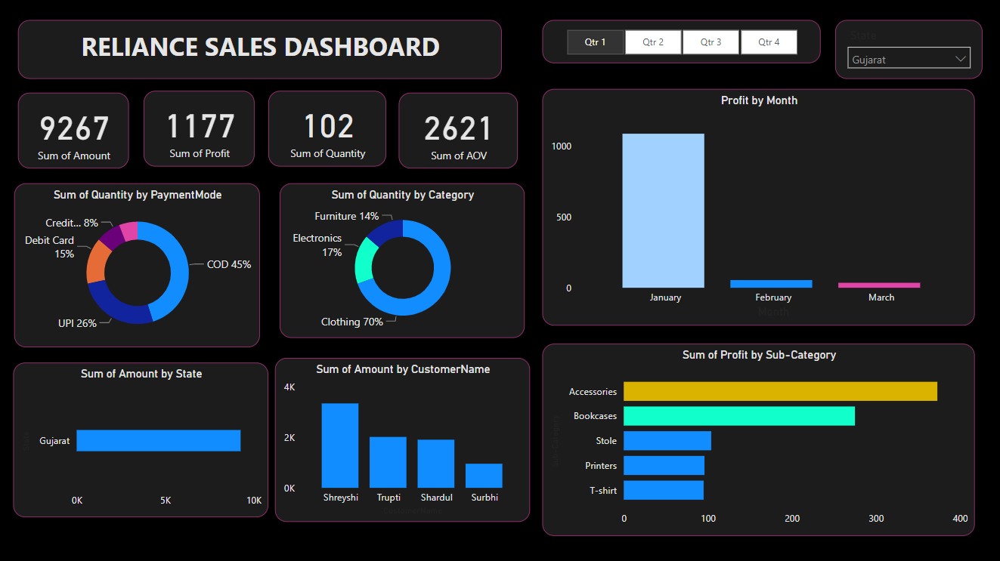
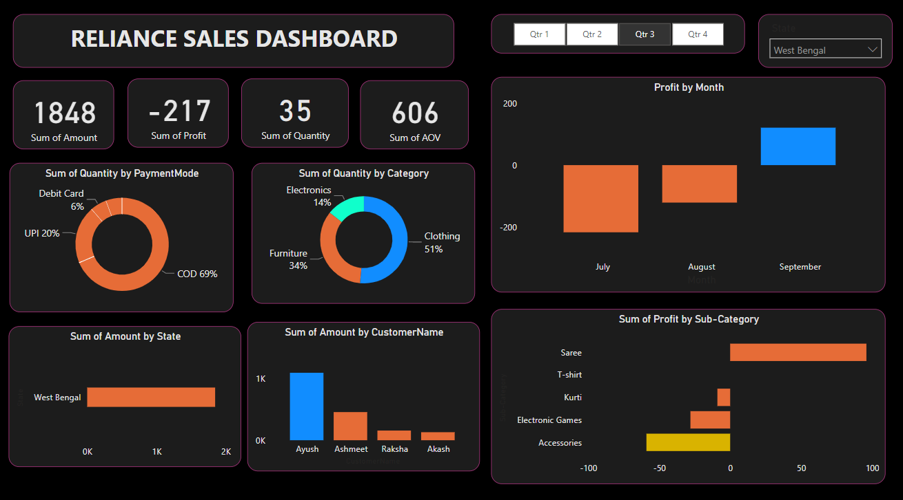

# Reliance Mart Sales Dashboard

Welcome to the Reliance Mart Sales Dashboard project! In this analysis, we have explored two CSV files, Orders and Details, to create an insightful Power BI dashboard showcasing the sales performance of Reliance Mart. The dashboard provides data based on the quarter of the year and the state of our country. Various interactive charts, including donut charts, slicers, and stack charts, are utilized to present key metrics such as the sum of the average value, profit, and quantity.

## Dashboard Overview

Our Power BI dashboard offers a comprehensive view of Reliance Mart's sales performance, allowing stakeholders to make data-driven decisions. The dashboard's key features include:

- **Quarterly Performance Analysis:** Easily analyze sales performance for each quarter of the year. Understand how sales evolve over time and identify trends.

- **Geographical Insights:** Explore sales data for different states of our country. Uncover variations in sales across regions and identify potential growth opportunities.

- **Various Charts:** The dashboard incorporates a variety of charts, including donut charts, slicers, and stack charts, to provide visual representations of critical sales metrics.

## Files Overview

Here is a quick overview of the files used in this project:

- **Orders.csv:** This CSV file contains the order data for Reliance Mart, including order IDs, dates, customers, and states.

- **Details.csv:** The Details CSV file contains order details, such as products, quantities, prices, and profits.

- **RelianceDashboard.pbix:** This Power BI file holds the entire dashboard configuration and visualization settings. To explore the dashboard, you need to open this file using Power BI.

## Dashboard Preview

Below are two preview images of the dashboard:

-  - Data for state Gujarat and Quarter-1.
-  - Data for state West Bengal and Quarter-3.

## How to Use

To access and interact with the Reliance Mart Sales Dashboard, follow these steps:

1. **Install Power BI:** If you don't have Power BI installed, download and install it from the official website (https://powerbi.microsoft.com).

2. **Open RelianceDashboard.pbix:** Open the RelianceDashboard.pbix file using Power BI to access the complete dashboard.

3. **Explore Data:** Use the interactive features of the dashboard to explore sales data for different quarters and states. Hover over charts, click on slicers, and explore the insights provided.

## Contributions

We welcome contributions to enhance the Reliance Mart Sales Dashboard. If you have any ideas for improvement, new features, or bug fixes, please feel free to submit a pull request or open an issue in the GitHub repository.

## License

This project is provided under the MIT License. Refer to the `LICENSE` file for more details.

Thank you for exploring the Reliance Mart Sales Dashboard. We hope this analysis empowers you with valuable insights into Reliance Mart's sales performance. Happy analyzing!
